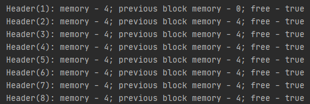
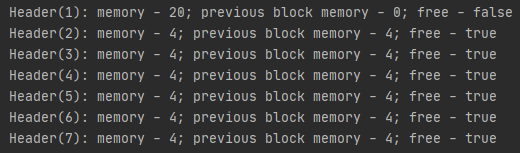
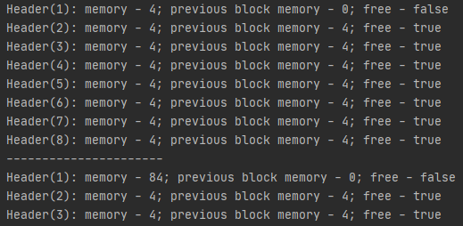
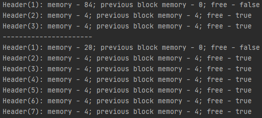

# Lab 1 - Allocator
## DESCRIPTION
## About allocator

A general purpose memory allocator must do at least **three tasks**: 
***allocating** a block of memory* of a given size, ***freeing** the allocated memory block* and 
***resizing** the allocated memory block*. These functions constitute a general purpose memory allocator interface.

Each block has a **header** and the **data**. Header always has a fixed size of **12 bytes**.
All blocks are **4-byte** aligned.
That means, to allocate **8 bytes** of memory, we need at least **24 bytes** of free memory. The structure of header:
> [memory size(4 bytes), previous block size(4 bytes), placeholder(3 bytes), data is free(1 byte)]

### Algorithm description

#### Allocate function
```
void* mem_alloc(size_t size)
```

When the `mem_alloc` function has called, it searches for the block of free memory, 
satisfying the size criteria (the size of that free block has to be at least `size` + `HEADER_SIZE`). 
If it found such - it occupies the block, if it didn't - it returns the `null`.

### Reallocate function
```
void* mem_realloc(void* addr, size_t size)
```

This function calls first of all decides, if it has to make the block smaller or bigger.

***If the block is going to become ~~bigger~~ smaller***, the current memory block will be split into two: 
the *'new data'* block, and the *'freed memory'* block. Then the `mem_free` function has called 
(*'freed memory'* block pointer has passed there as an argument).

***If the block is going to become bigger***, first of all, it is analyzed, if the memory block can 
*"overflow"* to the adjacent block of free memory (if they exist). 
If it's not possible, the `mem_alloc` function has called to find the free memory 
block with enough free memory, and the data has copied to the new block. 
The old block data has deleted, the `mem_free` has called with the old block 
data pointer passed as the argument.

### Free memory function
```
void mem_free(void* addr)
```

The function deletes the data of the block, flags it as the *'free memory'* 
block and tries to merge with adjacent *'free memory'* blocks, if present.

## HOW TO USE

To use the algorithm, you can choose 1 of 2 ways. **First**, you can manually
compile 2 files(***Allocator.java***, ***Util.java***) and then run them with java application. It's a hard way.
Second, you can run **IntellijIdea** or **Eclipse** and start the main function of ***Allocator.java***.

## DEMONSTRATION

>All memory state outputs are made with the `mem_dump` function, which, basically, 
>goes through 'our' heap and prints the states of all the existing blocks.

### Creation of our allocator
#### In this example we use *128* bytes memory and *16* bytes for block size
##### Code
```
Allocator allocator = new Allocator(128, 16);
allocator.dump();
```

##### Output

---

### The allocation of *5* bytes of memory
#### Block can contain only *4* bytes. We must join *2* blocks
##### Code
```
int index = allocator.memAlloc(5);
allocator.dump();
```

##### Output

---

### The freeing of *5* bytes of memory
#### Optimize method split a large block into smaller for reuse
##### Code
```
allocator.memFree(index);
allocator.dump();
```

##### Output

---

### The allocating of *1* byte of memory and then expand him
#### If we expand the memory we must do the same things as at `alloc` function
##### Code
```
index = allocator.memAlloc(1);
allocator.dump();
allocator.memRealloc(index, 80);
allocator.dump();
```

##### Output

---

### The allocating of *80* bytes of memory and then reduce him
#### If we reduce the memory we should do the same things as at `free` function
##### Code
```
index = allocator.memAlloc(80);
allocator.dump();
allocator.memRealloc(index, 1);
allocator.dump();
```

##### Output

