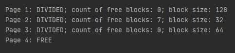
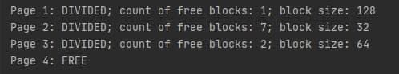
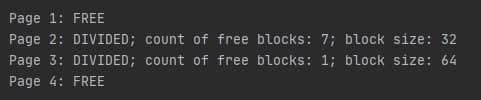
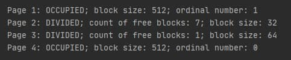
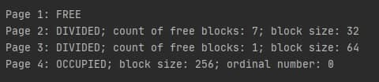

# Lab 2 - Page Allocator
## DESCRIPTION
## About page allocator algorithm

All memory available to the allocator is divided into pages. 
The page size can be from **4 KB** to **several megabytes**. All pages have the same size.

Each page is divided into blocks of fixed size. From the very beginning of the allocator,
none of the pages is marked (divided) into blocks. Page formatting is done while the program is running.
This is because we can't know exactly how to shuffle pages and what size blocks will be used most often.

Each page can be in only three states: **divided** into blocks, **occupied** by a multi-page block, and **free**.

The allocator saves the following page data:

* a descriptor exists for each marked page. All the descriptors I stored in the array. 
The descriptor looks like this: 
> [4 bytes for type of page; 4 bytes for first free block (or block size for multi page block);
> 4 bytes for count of free blocks (or ordinal of page for multi page block); 
> 4 bytes for block size (or address of the next page for multi page block)]
* a hashmap with lists of pages that have at least one free block.
> key - size; value - list of addresses

* an array with free pages.

More about the second point. I used a variant with a hashmap in which the key is the size of the block,
and the value is a list of pages that have at least one free block. This means that pages with all 
occupied blocks will not be included in this list. When allocating memory, we need to see if the resulting page 
is filled to the maximum page and whether it needs to be removed from the list. 
When freeing memory, you should also check to see if you want to add the page to the list.

On the page itself, all free blocks form a list. That is, if the block is free, then we can 
write in it the address for the next free block, and it will not bother anyone, because this 
block is free. The handle stores a pointer to the first free block. When we give a block to work, 
the descriptor simply remembers the full block from the list. When we clear a block, that block is 
added to the beginning of the list, and the descriptor starts pointing to it.
### Algorithm description

#### Allocate function
```
void* mem_alloc(size_t size)
```

First, the size of the requested memory size must be rounded to the first larger degree of 2.
Then we can have 2 variants:
* size <= page size
* size > page size

If the first case: After that we look for a page in our hashmap in which there is a free place. 
Since the hashmap values pages with free blocks, we can simply take the first one from that list. 
If it does not have it, we take an unmarked page and mark it with blocks of the required size 
(not forgetting to create a new descriptor for it) and add it to the hashpam. After selecting a 
page, the address of the first free block is stored separately from its handle (this address will 
be returned to the user) and the counter of free blocks is reduced by -1. After that, update the 
pointer to the first free block in the handle. If there are no more free blocks on the page 
(it is easy to look at the counter), then we delete this page from the hashmap.

If the second case: Let's see if there are free pages in the hashmap. If there are, we take them. 
If not, then take as many free pages as needed, create a descriptor for each of them. 
In the first descriptor we specify the full size of the block (ie the size of these several pages together). 
The rest of the descriptors are just for numbers. We return to the user the pointer to the beginning of the 
first page from taken.

### Reallocate function
```
void* mem_realloc(void* addr, size_t size)
```

This function use memFree and memAlloc functions. First, we must define which type of block we want to reallocate.
If it's free block, we just call memAlloc function. If it's another two types, we just remember current information
,freed this memory and try to allocate. If allocate done successfully it's done. If no, we just rollback
to previous state. 

### Free memory function
```
void mem_free(void* addr)
```

By the given address, define the page number. After that find page's descriptor. And we have 2 cases:
* clean block with size *less* than half a page
* clean block with size *more* than half a page

First case: increment count of free pages in descriptor and refresh pointer to first free block. If the page was 
fully occupied by blocks, we add it to hashmap again.

Second case: just clear our descriptor and add page address to array of free pages.
## HOW TO USE

To use the algorithm, you can choose 1 of 2 ways. **First**, you can manually
compile 2 files(***Allocator.java***, ***Util.java***) and then run them with java application. It's a hard way.
Second, you can run **IntellijIdea** or **Eclipse** and start the main function of ***Allocator.java***.

## DEMONSTRATION

>All memory state outputs are made with the `mem_dump` function, which, basically, 
>goes through 'our' heap and prints the states of all the existing blocks.

### Creation of our allocator
#### In this example we use *1024* bytes memory and *256* bytes for page size
##### Code

```
Allocator allocator = new Allocator(1024, 256);
System.out.println(allocator.dump());
```

##### Output

---

#### Allocating different size of memory for check dividing into blocks
##### Code

```
int addr1 = allocator.memAlloc(80);
int addr2 = allocator.memAlloc(90);
allocator.memAlloc(25);
int addr3 = allocator.memAlloc(50);
allocator.memAlloc(50);
int addr4 = allocator.memAlloc(50);
allocator.memAlloc(50);
System.out.println(allocator.dump());
```

##### Output

---

#### Free some blocks less than half of the page (used variables from example above)
##### Code

```
allocator.memFree(addr1);
allocator.memFree(addr3);
allocator.memFree(addr4);
System.out.println(allocator.dump());
```

##### Output

---

#### Realloc block less than half of the page (used variables from example above)
##### Code

```
allocator.memRealloc(addr2, 40);
System.out.println(allocator.dump());
```

##### Output

---

#### Alloc multi page block (used variables from example above)
##### Code

```
addr1 = allocator.memAlloc(257);
System.out.println(allocator.dump());
```

##### Output

---

#### Realloc block less than half of the page (used variables from example above)
##### Code

```
allocator.memRealloc(addr1, 200);
System.out.println(allocator.dump());
```

##### Output

---
