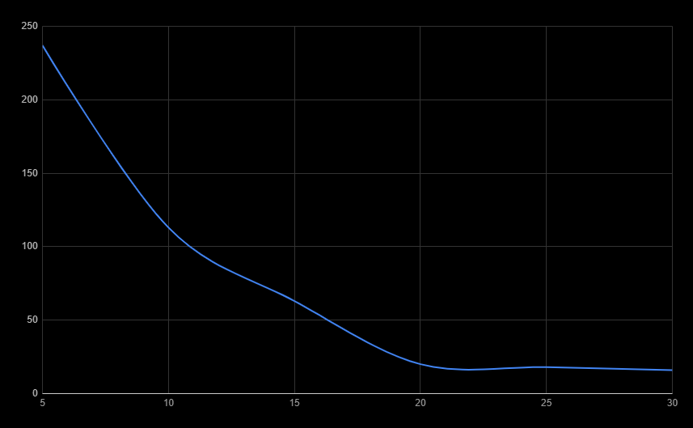
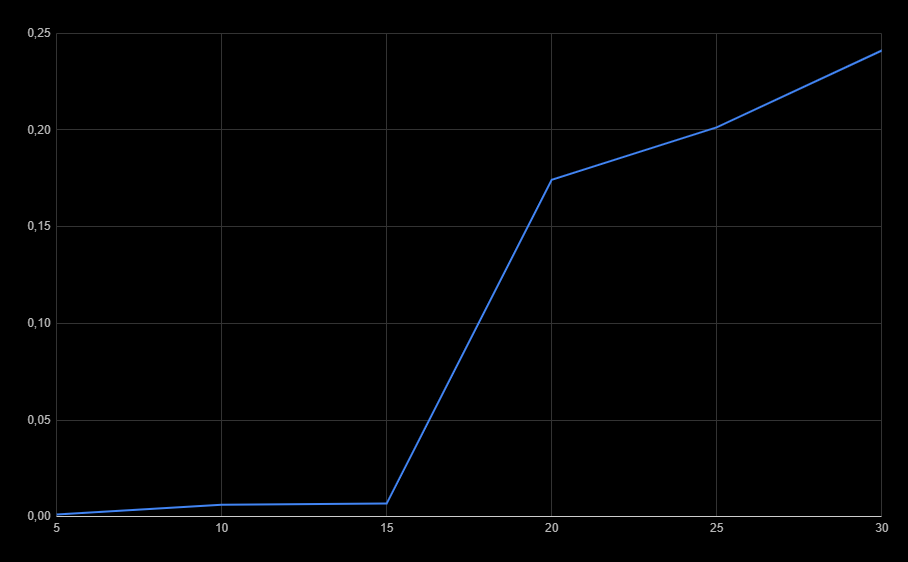
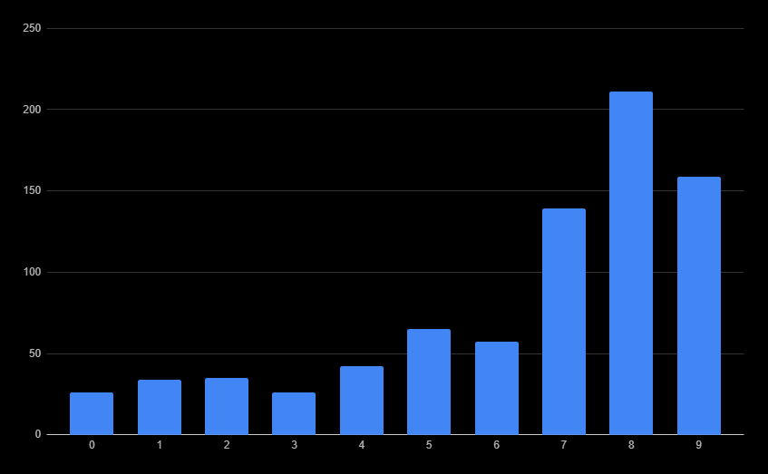

# Lab 3 - Research of disciplines of service of requests at limited resources
## Theory

The efficiency of a computer system depends not only on their own
efficiency of information processing algorithms and technical characteristic's
computer system, but also from the rules of performance of works accepted in system,
receiving and processing user requests.
The effectiveness of maintenance methods is determined by the possibility of delay or
loss of the request before processing, as well as the time of the request in the system. Depending on
type of management and scheduling system, the delay of requests can be taken into account by
the total average delay time or the allowable waiting time.

## FIRST IN- FIRST OUT (FIFO)

FIFO is the simplest process planning strategy and is that
the resource is transferred to the process that first accessed it. When
the process enters the queue of finished processes, the process control block joins the tail of the queue. 
The average waiting time for a FIFO strategy is often quite large and
depends on the order of receipt of processes in the queue of finished processes.

## FIFO service discipline with priorities without displacement

Each request has its own priority. Requests with the same priorities are grouped into a FIFO queue. First, the queue with the highest priority is served. Request that
hit the processor cannot be pushed out of it until it is complete
service.

Let's take a look for some experimental graphics:

### The average waiting time for the intensity of the incoming flow of requests

For example: tasks sends every 5 ms and then average time of waiting is ~240

### The dependence of the percentage of downtime on the intensity of the incoming flow of requests

For example: when tasks are sending every 30 ms, the percentage of downtime is ~0.25

### Dependence of the average waiting time on the priority at a fixed intensity of the incoming flow of applications

For example: 0-4 priorities don't wait too much, but the last 3 do it