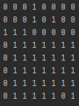
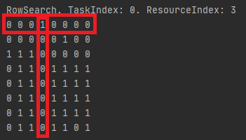
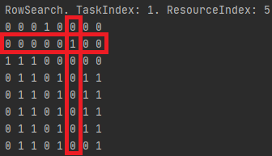
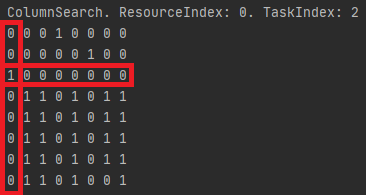
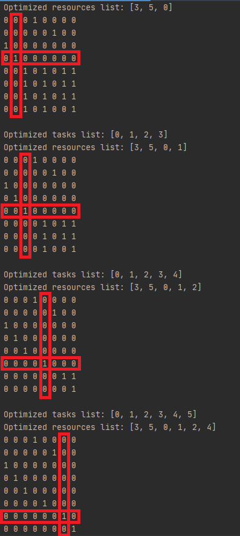
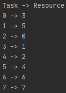

# Lab 4 - Research of principles of design and work of dynamic and static planning 
## Not exclusive planning

The essence of planning, which does not exclude, is as follows.
We need to find such appointments that we can't do without - that is, 
those that claim a single resource.

### Rule 1 
It is necessary to find in a destination matrix such line which contains only one unit, 
on this cell to execute assignments, and to reduce a matrix. 

### Rule 2
The same assumption can be made about a resource - if the resource is claimed by one
task - it must be assigned to him. This is a search for a unit in a column, followed by the same purpose.

### Rule 3
There are cases when the matrix is not reduced to the end - there are no rows / columns in which only one 
unit - therefore, perform the appointment randomly - especially the result will not be affected, and then reduce the matrix.

In our application I tried to use all 3 rules sequentially.

## Example
### Initial state

In this example we have 8 tasks and 8 resources. Let's plan it!

### First step

Here we used our first rule. We found the row with only 1 unit.

### Second step

All the same as in first step.

### Third step

Here we used our second rule. We found the column with only 1 unit.

### Last steps

At least when no rows and no columns with only 1 unit, we used our third rule
We just simply take first unit and make reduce.

## Result

Now we can see our result in task to resource relation like Map<Integer, Integer>

