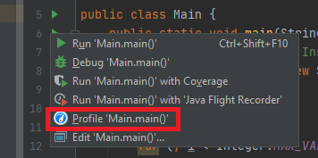
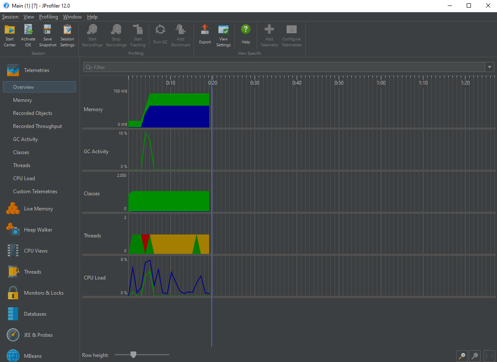
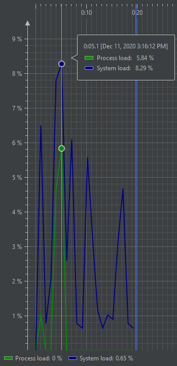
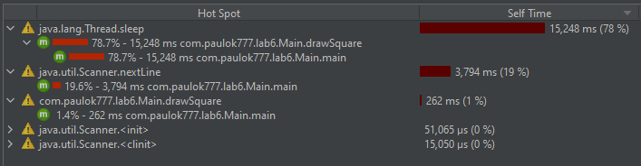

# Lab 6 - Profiler

First, we need to check our code and try to find some bottlenecks. As we can see, functions
drawSquare() and drawCircle() create matrix 10000 * 10000. It's not an easy operation. Then 
we iterate over all elements and switch our thread state into waiting by 1 second on every increment 
of i parameter. Below you can see this sample of code.

```
    public static void main(String[] args) {
        System.out.println("\n Inside main()");
        String typeOfShape = new Scanner(System.in).nextLine();

        int i = 0;

        for (; i < Integer.MAX_VALUE; i++) ;

        switch (typeOfShape) {
            case "square":
                drawSquare();
                break;
            case "circle":
                drawCircle();
                break;
        }
    }

    private static void drawSquare() {
        int[][] squarePixels = new int[10000][10000];
        for(int i = 0; i < 10000; i++) {
            try {
                Thread.sleep(1);
            } catch (InterruptedException e) {
                e.printStackTrace();
            }
            for (int j = 0; j < 10000; j++) {
                //process of drawing
                squarePixels[i][j] = i + j;
            }
        }
    }

    private static void drawCircle() {
        int[][] circlePixels = new int[10000][10000];
        for(int i = 0; i < 10000; i++) {
            //process of drawing
            try {
                Thread.sleep(1);
            } catch (InterruptedException e) {
                e.printStackTrace();
            }
            for (int j = 0; j < 10000; j++) {
                circlePixels[i][j] = i * j;
            }
        }
    }
```

For profiling java application we will use JProfiler. We need to install him and
if we work in IntelliJIDEA we need to install the plugin JProfile.
After that we must run our application by the Profile. For example:


## Analysis with JProfiler

Now we can see the snapshot of our system components and their usage. In our example we can see next:


We are interested in: "Telemetries" -> "Overview", "Telemetries" -> "CPU Load", "CPU Views" -> "Hot Spots"

In "Telemetries" -> "Overview" tab we can the global overview. As we can see at Memory tab we used 400MB of memory, 
our garbage collector did some work, we used only 1 thread which was in 3 states: runnable, waiting, blocked.

In the "Telemetries" -> "CPU Load" we can see our CPU maximum pick:


Now we will go to the bottlenecks. Let's move to the "CPU Views" -> "Hot Spots".


We can see that the main bottleneck is the java.lang.Thread.sleep function: 78.7% of process times 15,248ms.
The next is Scanner.nextLine(). It's not a bottleneck because thread was in blocked state until we enter some info.
The last bottleneck is drawSquare function. But it's only 1.4% of process time, 262ms. The total time of process: 19.8s 